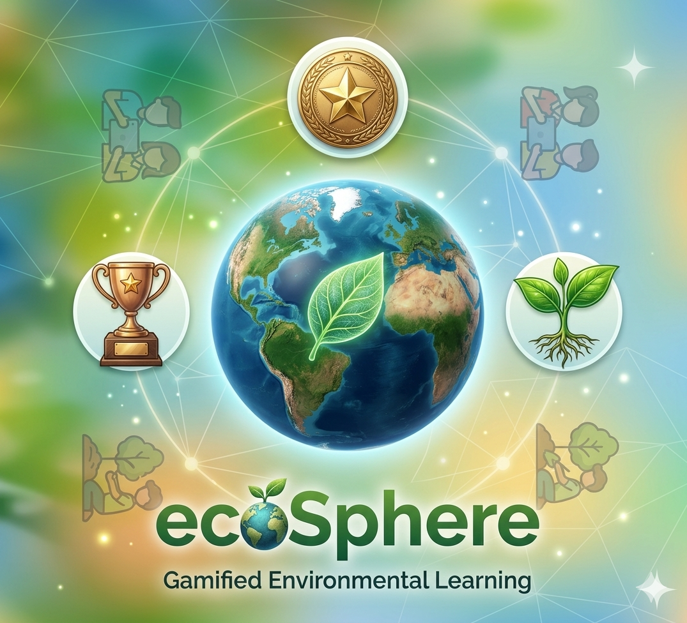

# 🌍 EcoSphere — Gamified Environmental Education Platform

<p align="center">
  
</p>

<p align="center">
  <strong>Learn. Act. Sustain.</strong>
</p>

<p align="center">
  
  
  
  
</p>

---

## 📌 Overview

**EcoSphere** is a multi-tenant environmental education platform designed for schools. It transforms passive eco-learning into an active, measurable, and engaging experience through gamification, structured learning modules, real-world eco-challenges, and a competitive leaderboard system.

The platform consists of two parts:
- **Android Mobile App** — The core learning and management platform used daily by students and teachers
- **School Registration Web Portal** — A one-time onboarding tool for school administrators

---

## 🎯 Problem Statement

Environmental awareness among school students is critically low. Schools lack a dedicated digital platform to:
- Deliver structured eco-education in an engaging way
- Track student progress on environmental learning
- Motivate students to take real-world eco-actions
- Manage content and students across multiple schools independently

Traditional methods (textbooks, lectures) are passive and fail to motivate students to take actual environmental action.

---

## 💡 Solution

EcoSphere solves this through a **gamified, multi-school platform** where:
- Students earn EcoPoints by completing modules, passing quizzes, and submitting eco-challenges
- Teachers manage all content scoped exclusively to their school
- Each school operates independently with complete data isolation (multi-tenancy)
- Real-time leaderboards and a progression system keep students motivated

---

## 🏗️ Architecture

```
School Admin ──► Web Portal ──► Registers School ──► Gets 14-char School Code
                                                              │
Lead Teacher ──► Mobile App ──► Joins via School Code ──► Auto-approved
                                                              │
Normal Teachers ──► Join via School Code ──► Await Lead Teacher approval
                                                              │
Students ──► Join via School Code ──► Select Batch ──► Start Learning
```

**Multi-Tenancy:** Every piece of data is tagged with `schoolId`. Students and teachers only ever see their own school's content, enforced at both the app layer and Firestore security rules.

---

## 👥 User Roles

| Role | Description |
|---|---|
| **Student** | Learns modules, takes quizzes, submits eco-challenges, earns points, competes on leaderboard |
| **Normal Teacher** | Creates content, manages batches, reviews challenge submissions, sends announcements |
| **Lead Teacher** | All teacher features + approves/rejects teacher registrations + platform settings |

---

## ✨ Features

### 🎓 Student Portal
- **Learning Modules** — Structured content created by teachers
- **Quiz Engine** — Must pass quiz (configurable threshold) to unlock module completion
- **Eco-Challenges** — Submit real-world eco-actions with photo proof
- **EcoPoints & Leveling** — 10-level progression from Eco Seedling 🌱 to Eco Master 🏆
- **Real-time Leaderboard** — Live school-scoped ranking via Firestore snapshot listeners
- **Daily Streak** — Tracks consecutive login days
- **Progress Tracker** — Module %, challenge %, quiz pass rate, overall progress
- **Announcements** — School-specific announcements from teachers
- **Push Notifications** — Real-time alerts via FCM
- **Ecosystem Strategy Game** — Make eco-decisions across 8 scenarios, earn up to 10 points
- **Eco AI Assistant** — Chatbot for eco-related questions

### 👨‍🏫 Teacher Portal
- **Dashboard Analytics** — Total students, active today, total EcoPoints, avg completion %
- **Module Management** — Full CRUD with school-scoped content
- **Quiz Management** — Add/edit questions per module
- **Challenge Management** — Create challenges with point values, toggle active/inactive
- **Review Challenges** — Approve/reject submissions with feedback, auto-awards points
- **Send Announcements** — School-scoped, reflects instantly on student portal
- **Push Notifications** — FCM notifications to all school students
- **Batch Management** — Create and manage class batches
- **Top Performers** — View top 10 students by EcoPoints
- **Live Activity Feed** — Real-time feed of student actions
- **Teacher Approval** *(Lead Teacher only)* — Approve/reject pending teacher registrations
- **Platform Settings** *(Lead Teacher only)* — Quiz pass threshold, attempt limits, notification timing

### 🌐 Web Portal (School Registration)
- Register school with full details
- Generates a guaranteed 14-character unique school code
- Download registration details as a text file
- Directly saves to Firebase Firestore

---

## 🏆 Gamification System

| Level | Title | Points Required |
|---|---|---|
| 1 | Eco Seedling 🌱 | 0 |
| 2 | Eco Sprout 🌿 | 100 |
| 3 | Eco Explorer 🌳 | 250 |
| 4 | Eco Guardian 🌍 | 500 |
| 5 | Eco Champion ⭐ | 800 |
| 6 | Eco Expert 🔥 | 1,100 |
| 7 | Eco Warrior 🛡️ | 1,500 |
| 8 | Eco Sage 🌟 | 2,000 |
| 9 | Eco Legend 💎 | 2,700 |
| 10 | Eco Master 🏆 | 3,600 |

**Points are earned from:**
- ✅ Completing a module → exact points set by teacher
- ✅ Getting a challenge approved → exact points set by teacher
- ✅ Ecosystem Game → 0–10 points based on performance

---

## 🛠️ Tech Stack

| Category | Technology |
|---|---|
| Language | Kotlin |
| Platform | Android SDK 24–34 |
| UI | Material Design 3, ViewBinding |
| Database | Firebase Firestore (NoSQL, real-time) |
| Authentication | Firebase Auth (Email/Password) |
| File Storage | Firebase Storage |
| Push Notifications | Firebase Cloud Messaging (FCM) |
| Background Jobs | WorkManager (daily reminders) |
| Image Loading | Glide |
| Async | Kotlin Coroutines |
| Architecture | MVVM, Repository Pattern |
| Web Portal | HTML, CSS, JavaScript, Firebase Web SDK |
| Version Control | Git, GitHub |

---

## 📁 Project Structure

```
EcoSphere/
├── app/
│   ├── src/main/
│   │   ├── java/com/example/capstone/
│   │   │   ├── models/          # Data models (User, School, Batch, etc.)
│   │   │   ├── repository/      # Firebase data layer (AuthRepository)
│   │   │   ├── utils/           # Utilities (LevelCalculator, SchoolCodeGenerator)
│   │   │   ├── services/        # FCM & Push Notification services
│   │   │   ├── workers/         # WorkManager (DailyReminderWorker)
│   │   │   ├── viewmodel/       # MVVM ViewModels
│   │   │   └── *.kt             # 66+ Activities and Fragments
│   │   └── res/                 # 75+ XML layouts, drawables, values
│   └── google-services.json.example  # Template — add your own
├── school-registration-portal/
│   ├── index.html               # Registration form
│   ├── app.js                   # School code generation logic
│   ├── styles.css               # Portal styling
│   ├── firebase-config.js.example  # Template — add your own
│   └── README.md
├── firestore.rules              # Firestore security rules
├── .gitignore
└── README.md
```

---

## 🚀 Getting Started

### Prerequisites
- Android Studio (latest)
- Firebase account
- Node.js (for Netlify deployment of web portal)

### 1. Firebase Setup
1. Create a project at [Firebase Console](https://console.firebase.google.com)
2. Enable **Authentication** (Email/Password)
3. Enable **Firestore Database**
4. Enable **Storage**
5. Enable **Cloud Messaging**
6. Deploy Firestore security rules from `firestore.rules`

### 2. Android App Setup
```bash
# Clone the repository
git clone https://github.com/jhaabhinandan78/EcoSphere-Gamified-Environmental-Education-Platform.git

# Open in Android Studio
# Copy the template and add your Firebase credentials
cp app/google-services.json.example app/google-services.json
# Edit google-services.json with your actual Firebase project values

# Build and run
```

### 3. Web Portal Setup
```bash
# Navigate to web portal folder
cd school-registration-portal

# Copy the template and add your Firebase credentials
cp firebase-config.js.example firebase-config.js
# Edit firebase-config.js with your actual Firebase web app values

# Open index.html in browser OR deploy to Netlify
```

---

## 🔐 Security

- **`app/google-services.json`** — Contains real Firebase API keys. **Never commit this file.** Use `google-services.json.example` as a template.
- **`school-registration-portal/firebase-config.js`** — Contains real Firebase web API keys. **Never commit this file.** Use `firebase-config.js.example` as a template.
- All sensitive files are listed in `.gitignore`
- Firestore security rules enforce school-level data isolation — students cannot access other schools' data

---

## 📊 Project Scale

- **66+ Kotlin files** across the Android app
- **75+ XML layout files**
- **3 role-based portals** (Student, Teacher, Lead Teacher)
- **15+ Firestore collections** with security rules
- **Multi-school support** — unlimited schools on one platform
- **Real-time features** — leaderboard, teacher approval, activity feed

---

## 👨‍💻 My Contribution

This is a capstone group project. My role was the **complete Android application development**:
- Designed and implemented all 3 role-based portals
- Built the multi-tenant architecture with school-based data isolation
- Implemented gamification system (EcoPoints, 10-level system, leaderboard)
- Built quiz engine with configurable pass thresholds and daily attempt limits
- Developed challenge submission and review workflow
- Integrated Firebase Auth, Firestore, Storage, and FCM
- Implemented Firestore security rules for data protection
- Connected web portal onboarding flow with mobile app registration

The **school registration web portal** was developed by my teammates.

---

## 📄 License

This project was developed as a capstone project for academic purposes.

---

<p align="center">
  Made with ❤️ for a greener future 🌱
</p>
